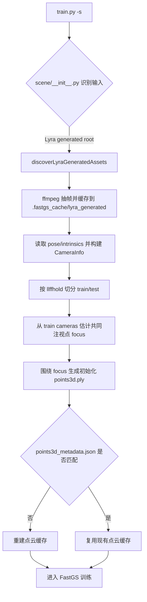
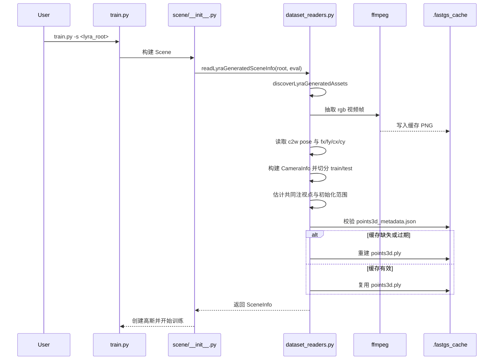

# Lyra Direct Loader

## 目标

- 让 `train.py -s <lyra_root>` 直接读取 Lyra generated root.
- 复用现成 `pose/*.npz` 与 `intrinsics/*.npz`.
- 避免重新跑 COLMAP.
- 避免 object-centric 场景因为错误初始化点云而首轮训练失败.

## 输入约定

- 根目录结构:
  - `view_id/rgb/<scene>.mp4`
  - `view_id/pose/<scene>.npz`
  - `view_id/intrinsics/<scene>.npz`
- `pose/*.npz`
  - `data`: `[T, 4, 4]`
  - `inds`: `[T]`
  - 语义: `c2w`
- `intrinsics/*.npz`
  - `data`: `[T, 4]`
  - `inds`: `[T]`
  - 语义: `[fx, fy, cx, cy]`

## Flowchart

## Sequence

## 当前实现结论

- `train.py` 已经可以直接吃 Lyra generated root.
- `scripts/run_lyra_fastgs.sh` 已提供一键训练入口.
- `scripts/run_lyra_flashvsr_reference.sh` 已提供独立的 FlashVSR 超分入口.
- `scripts/run_lyra_flashvsr_fastgs.sh` 已提供 `FlashVSR -> FastGS` 串联入口.
- `scripts/run_lyra_fastgs.sh` 现已支持:
  - `--phase train`
  - `--phase render`
  - `--phase metrics`
  - `--phase evaluate`
  - `--phase all`
- 初始化点云不再围绕原点, 而是围绕 train cameras 的共同注视点.
- 旧版错误缓存会因为 `points3d_metadata.json` 不匹配而自动重建.

## 脚本阶段说明

- `train`
  - 只跑 `train.py`
- `render`
  - 只跑 `render.py`
- `metrics`
  - 只跑 `metrics.py`
- `evaluate`
  - 顺序执行 `render.py -> metrics.py`
- `all`
  - 顺序执行 `train.py -> render.py -> metrics.py`

补充:
- `metrics.py` 依赖 `test/` 下的渲染结果, 因此 `all` 阶段要求训练保留 `--eval`.
- 评估阶段会优先从 `cfg_args` 回读训练时保存的 `mult`, 避免 `render.py` 的命令行默认值覆盖训练口径.

## 与 COLMAP 传统流程的关系

- `scripts/run_lyra_fastgs.sh`
  - 直接复用 Lyra 自带 `pose/intrinsics`
  - 不跑 COLMAP
- `scripts/run_lyra_colmap_fastgs.sh`
  - 完全不读取 Lyra 自带 `pose/intrinsics`
  - 只使用 `rgb/*.mp4`
  - 走 `convert.py -> train.py -> render.py -> metrics.py`
  - 当前已修复 `scene/colmap_loader.py` 对 `COLMAP images.bin` / `images.txt` 的图像名解析
  - 已支持:
    - 中文文件名
    - 带空格文件名
    - `--source-video` 场景下的长 `scene_stem`
- `scripts/run_lyra_flashvsr_fastgs.sh`
  - 先用 `FlashVSR-Pro` 对 `rgb/*.mp4` 做超分
  - 再构造一个只替换 `rgb`、但继续复用原始 `pose/intrinsics` 的 Lyra 风格 SR root
  - 可选择:
    - `--pipeline direct`
    - `--pipeline colmap`

## FlashVSR 串联脚本约定

- `scripts/run_lyra_flashvsr_reference.sh`
  - 只负责超分
  - 不启动 FastGS
- `scripts/run_lyra_flashvsr_fastgs.sh`
  - `--phase superres`
    - 只跑 FlashVSR
  - `--phase prepare`
    - `direct`: 超分 + 生成 SR root
    - `colmap`: 超分 + 生成 SR root + 继续跑 COLMAP prepare
  - `--phase train`
    - 复用已有 SR 输出, 不重复超分
    - `direct` 路线会先确保 SR root 已组织好, 再交给 `run_lyra_fastgs.sh`
  - `--phase all`
    - `FlashVSR -> SR root -> direct/COLMAP -> FastGS train/render/metrics`
- 该串联脚本支持直接传:
  - `--source-video "/path/to/<长中文文件名>.mp4"`
- 对带空格、中文、逗号的 `scene_stem`, 当前做法是:
  - 整体路径用引号包起来
  - 由脚本自动反推 `source-path`、`scene-stem` 和完整 `view-ids`

适用场景:
- 如果目标是“最大化复用 Lyra 已知相机参数”, 用 direct loader.
- 如果目标是“拿同一份视频走标准 SfM 基线, 比较 Lyra 参数与 COLMAP 参数谁更好”, 用 `run_lyra_colmap_fastgs.sh`.
