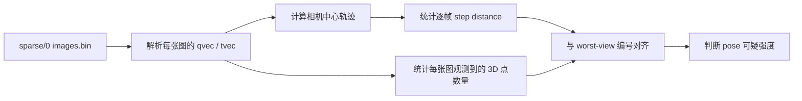
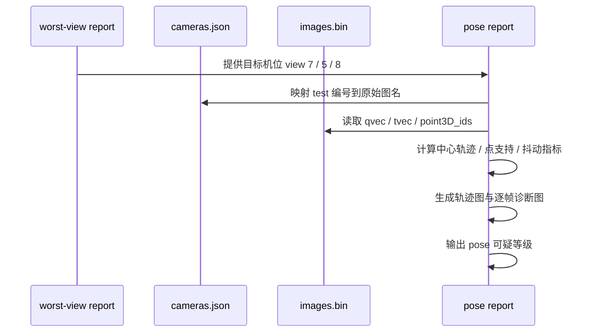

# `my5` COLMAP 位姿回查报告

## 背景

- 数据目录: `data/my5_colmap_fastgs`
- COLMAP 模型: `data/my5_colmap_fastgs/sparse/0`
- 对应训练结果: `output/my5_nomask_v1`
- 这次回查的目标机位:
  - `view 7`
  - `view 5`
  - `view 8`

这 3 个机位来自上一份 worst-view 报告.

它们是 `ours_35000` 里最值得继续追的方向.

## 这份报告回答什么

这份报告只回答一个核心问题:

> `view 7 / 5 / 8` 到底有没有 COLMAP 位姿异常证据.

我这次主要看了 4 类证据:

1. 相机中心轨迹本身顺不顺.
2. 每张图观察到多少稀疏 3D 点.
3. 最差 test 帧是不是刚好落在“点支持差 / 轨迹跳”的位置.
4. 这几个机位之间, 哪个更像“真姿态问题”, 哪个更像“画面本身难”.

## 回查流程

## 已观察到的现象

### 1. `view 7` 是最强异常点

按机位统计后的关键指标:

| view | mean observed 3D pts | mean observed ratio | mean step distance | max step distance |
| --- | ---: | ---: | ---: | ---: |
| `7` | `852.3` | `0.4582` | `1.2833` | `2.2542` |
| `5` | `1238.9` | `0.6849` | `0.6159` | `0.8522` |
| `8` | `1276.3` | `0.7043` | `0.2273` | `0.3757` |

把这几个数放回全局 12 个机位里看:

- `view 7`
  - `obs_mean` 全部机位里最低
  - `ratio_mean` 全部机位里最低
  - `step_mean` 全部机位里最高
  - `step_max` 全部机位里最高
- `view 5`
  - `step_mean` 全部机位里第二高
  - 点支持不算差, 但轨迹抖动偏大
- `view 8`
  - 点支持正常
  - 轨迹抖动反而偏低

这三者已经不是一个级别了.

### 2. worst test 帧和点支持强相关

对应 worst test 帧的 COLMAP 支持度:

| test 图 | 原始机位 | 帧号 | observed pts | observed ratio | PSNR |
| --- | --- | ---: | ---: | ---: | ---: |
| `00031.png` | `view 7` | `6` | `590` | `0.2943` | `23.2433` |
| `00033.png` | `view 7` | `22` | `775` | `0.4149` | `23.4800` |
| `00037.png` | `view 8` | `27` | `1123` | `0.5494` | `24.3451` |
| `00024.png` | `view 5` | `4` | `1062` | `0.5446` | `24.5445` |
| `00026.png` | `view 5` | `20` | `1245` | `0.6811` | `25.0808` |

拿最好的一张 test 图对照:

| test 图 | 原始机位 | 帧号 | observed pts | observed ratio | PSNR |
| --- | --- | ---: | ---: | ---: | ---: |
| `00000.png` | `view 0` | `1` | `1488` | `0.8953` | `32.5076` |

`view 7` 的两张 worst test 图, 在点支持上明显更差.

这不是小波动.

### 3. `view 7` 的逐帧轨迹确实在跳

逐帧诊断图里, `view 7` 的两个特点最明显:

- 前段 `frame 2 ~ 6` 点支持持续掉到很低
- 同时连续帧相机中心位移多次冲到 `1.2 ~ 2.25`

而 `view 8` 的轨迹虽然半径跨度也大, 但它是比较顺的.

它更像一条连续运动轨迹.

`view 7` 则更像:

- 轨迹存在明显折返
- 或局部求解不稳定

## 图像证据

### 轨迹总览

- [pose_topdown_focus_views.png](/root/autodl-tmp/home/rais/FastGS/specs/my5_colmap_pose_report_assets/pose_topdown_focus_views.png)
- [pose_projection_focus_views.png](/root/autodl-tmp/home/rais/FastGS/specs/my5_colmap_pose_report_assets/pose_projection_focus_views.png)

### 机位异常散点图

- [pose_quality_scatter.png](/root/autodl-tmp/home/rais/FastGS/specs/my5_colmap_pose_report_assets/pose_quality_scatter.png)

这张图最直观.

`view 7` 既在最右边, 又在最下面.

也就是:

- 抖动最大
- 点支持最差

### 逐帧诊断图

- [focus_view_frame_diagnostics.png](/root/autodl-tmp/home/rais/FastGS/specs/my5_colmap_pose_report_assets/focus_view_frame_diagnostics.png)

这张图里:

- `view 7` 的红线最不稳定
- `view 5` 有明显波动, 但没 `view 7` 那么极端
- `view 8` 基本是顺的

## 假设与验证

### 当前主假设

`view 7` 有较强的 COLMAP 位姿异常嫌疑.

`view 5` 有中度嫌疑.

`view 8` 的 worst frame 更像不是位姿主导, 而是场景本身的高反射 / 细亮边缘难点.

### 支撑证据

#### 对 `view 7`

- 它是全机位里:
  - `obs_mean` 最低
  - `ratio_mean` 最低
  - `step_mean` 最高
  - `step_max` 最高
- 它的两张 worst test 图:
  - `00031`
  - `00033`
  都落在低支持度区间
- 投影图里 `view 7` 的轨迹折返和散开都比较明显

#### 对 `view 5`

- `step_mean` 和 `step_max` 都偏高
- 但点支持度没有明显掉到 `view 7` 那个程度
- 这更像“有些位姿不稳, 但没坏得那么重”

#### 对 `view 8`

- 点支持度健康
- 逐帧 step 很平顺
- 这说明它虽然也有 worst frame, 但姿态异常证据不强

### 最强备选解释

还有一种可能:

`view 7` 不一定是纯粹“解错了”.

也可能是这个机位本身看到的:

- 高反射
- 弱纹理
- 大面积光带

更容易让 SfM 特征匹配变差.

也就是说:

> “位姿异常” 和 “这个机位本来就难匹配” 可能是叠加关系, 不是二选一.

### 当前不能直接确认的部分

我现在还不能直接说:

- “根因已经确认就是 COLMAP 算错了”

因为还差一类更直接的证据:

- 把 `view 7 / 5 / 8` 的朝向向量和相邻机位做连续性对比
- 或者把 `view 7` 重跑局部 COLMAP / matcher 以后对照

所以更稳的口径是:

> 当前证据已经足够支持“`view 7` 是最强 pose 可疑点”, 但还没到“根因已唯一确认”的程度.

## 已验证结论

### 结论1

`view 7` 是当前最值得优先回查的机位.

这不是凭主观感觉.

它同时满足:

- worst-view 聚集
- COLMAP 点支持最低
- 连续帧轨迹抖动最高

### 结论2

`view 5` 值得跟着查, 但优先级低于 `view 7`.

### 结论3

`view 8` 虽然也出现在 worst-view 里, 但当前证据更偏向:

- 位姿大体还行
- 画面表达更难

### 结论4

下一步不应该继续盲目加训练步数.

更稳的顺序是:

1. 先核 `view 7`
2. 再核 `view 5`
3. 最后再回到训练调优

## 下一步建议

### 方向A: 做更硬的姿态连续性检查

优先对 `view 7 / 5 / 8` 增加:

- 相机 forward vector 连续性
- 朝向角速度
- 与邻近机位的相对位姿对比

如果这一步还能继续指向 `view 7`, 那 pose 异常判断会更硬.

### 方向B: 对 `view 7` 做局部重建对照

可以只抽 `view 7` 附近的几组相机和相邻帧, 做一次局部 COLMAP 对照.

如果局部重建后 `step_mean / obs_mean` 明显改善, 那就更接近“原始全局重建对这组机位不稳”.

### 方向C: 再谈训练

如果后面证实:

- `view 7` 的 pose 确实有问题

那训练侧继续加步数的收益就会很有限.

先处理几何, 再训练, 更划算.
