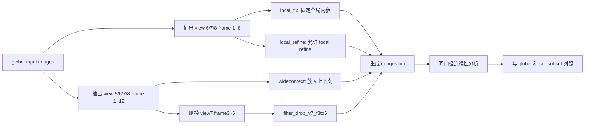
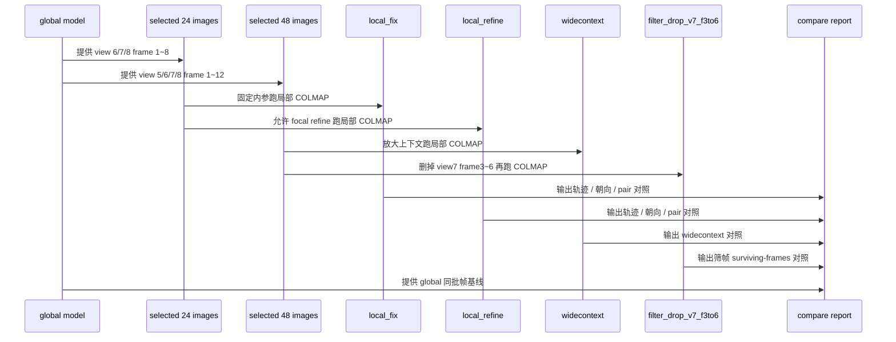

# `my5` 局部 COLMAP 对照实验报告

## 背景

- 全局模型:
  - `data/my5_colmap_fastgs/sparse/0`
- 对照目标:
  - `view 6 / 7 / 8`
  - `frame 1 ~ 8`
- 这次要验证的候选假设:

> 如果 `view 7` 前段的不稳定主要是“全局重建上下文把局部解坏了”, 那把这段单独抽出来重建后, `view 7` 的轨迹和朝向连续性应该明显改善.

我这次先做了 2 版局部实验, 后面又补了一版更大窗口对照, 最后再补了一版删帧对照:

1. `local_fix`
   - 固定全局内参
   - `fx=592.1701`
2. `local_refine`
   - 同样用全局内参做 prior
   - 但允许局部 BA 微调焦距
3. `widecontext`
   - 放大到 `view 5 / 6 / 7 / 8`
   - `frame 1 ~ 12`
   - 同样允许 focal refine
4. `filter_drop_v7_f3to6`
   - 仍然使用 `view 5 / 6 / 7 / 8`
   - 仍然使用 `frame 1 ~ 12`
   - 但删掉 `view 7 frame 3 ~ 6`
   - 同样允许 focal refine

## 这次怎么做

前两版局部实验统一使用:

- `24` 张图
- `view 6 / 7 / 8`
- 每个机位 `frame 1 ~ 8`
- `SIMPLE_PINHOLE`
- `single_camera = 1`
- `exhaustive_matcher`

补充的 `widecontext` 实验使用:

- `48` 张图
- `view 5 / 6 / 7 / 8`
- 每个机位 `frame 1 ~ 12`
- `SIMPLE_PINHOLE`
- `single_camera = 1`
- `exhaustive_matcher`

最后补做的 `filter_drop_v7_f3to6` 实验使用:

- 仍然从 `view 5 / 6 / 7 / 8 + frame 1 ~ 12` 出发
- 但删掉:
  - `view 7 frame 3`
  - `view 7 frame 4`
  - `view 7 frame 5`
  - `view 7 frame 6`
- 最终剩余:
  - `44` 张图
- `SIMPLE_PINHOLE`
- `single_camera = 1`
- `exhaustive_matcher`
- 连续性 summary 改用:
  - `--transition-summary-mode contiguous`

## 对照流程

## 已观察到的现象

### 1. 两版局部实验都能建出模型

- `local_fix`
  - 成功注册 `24/24`
- `local_refine`
  - 也成功注册 `24/24`
- 两版都有一个共同点:
  - 都不是第一次就找到好初始化 pair
  - 都是在放宽初始化约束后才真正起模型

这说明局部子集不是“完全无法重建”.

但它也不是“特别轻松、特别稳”的那种片段.

### 2. 固定内参的局部实验, 没有把 `view 7` 救回来

`view 7` 在 `frame 1 ~ 8` 的统计对比:

| experiment | obs_mean | ratio_mean | step_mean | step_max | rot_mean | rot_max |
| --- | ---: | ---: | ---: | ---: | ---: | ---: |
| `global` | `675.375` | `0.3550` | `1.3726` | `2.2542` | `3.9438` | `6.0948` |
| `local_fix` | `393.0000` | `0.2046` | `1.8088` | `2.7994` | `3.8531` | `5.6831` |

这里最关键的点是:

- `rotation_mean`
  - 只从 `3.9438` 变到 `3.8531`
  - 改善很小
- `step_mean`
  - 反而从 `1.3726` 变差到 `1.8088`
- `obs_mean`
  - 从 `675` 掉到 `393`

所以这版不能支持“局部重建明显更稳”这个判断.

### 3. 允许 focal refine 后, 也没有出现本质改善

局部 refine 后的相机参数:

- 初始 prior:
  - `592.1701, 640, 360`
- 最终结果:
  - `571.6432, 640, 360`

也就是说:

- focal 约下降了 `3.47%`

但 `view 7` 的结果依然没有被真正修好:

| experiment | obs_mean | ratio_mean | step_mean | step_max | rot_mean | rot_max |
| --- | ---: | ---: | ---: | ---: | ---: | ---: |
| `global` | `675.375` | `0.3550` | `1.3726` | `2.2542` | `3.9438` | `6.0948` |
| `local_refine` | `390.1250` | `0.2031` | `1.7861` | `2.8553` | `3.7371` | `5.6021` |

这次能看到:

- `rot_mean`
  - 有一点下降
  - `3.9438 -> 3.7371`
- 但 `step_mean`
  - 仍然明显更差
  - `1.3726 -> 1.7861`
- 点支持仍然大幅更低

所以“给局部 BA 一点内参自由度”这件事, 也没有把问题根本扭转.

### 4. 邻机位 pair 的连续性也没有出现决定性改善

重点看 `frame 1 ~ 8` 的相邻 pair:

| experiment | pair | delta_rot_mean | delta_rot_max | delta_dist_mean |
| --- | --- | ---: | ---: | ---: |
| `global` | `6-7` | `2.1944` | `4.3341` | `0.7675` |
| `local_fix` | `6-7` | `2.1904` | `3.8380` | `1.0499` |
| `local_refine` | `6-7` | `2.1274` | `3.6210` | `1.0429` |
| `global` | `7-8` | `2.7584` | `4.7595` | `0.9589` |
| `local_fix` | `7-8` | `2.7345` | `4.3649` | `1.2879` |
| `local_refine` | `7-8` | `2.6545` | `4.3541` | `1.2730` |

这组数据说明:

- 局部实验的 `delta_rot_mean` 只是轻微下降
- 但 `delta_dist_mean` 反而更差

所以 pair 级别也没有出现“明显被修顺”的信号.

### 5. `view 7` 的逐帧对照, 仍然保留了前段高抖动结构

和全局对照最有信息量的几帧:

| frame | global step | local_refine step | global rot | local_refine rot |
| --- | ---: | ---: | ---: | ---: |
| `2` | `1.0272` | `1.1816` | `3.3353` | `2.9841` |
| `3` | `2.2542` | `2.8553` | `6.0948` | `5.6021` |
| `4` | `1.8567` | `2.4951` | `5.2982` | `5.1527` |
| `5` | `1.8295` | `2.5069` | `5.2160` | `5.1343` |
| `6` | `1.2055` | `1.6799` | `3.5802` | `3.5180` |

可以看到:

- `frame 3 ~ 6`
  - 这段高抖结构还在
- rotation 有时略低一点
- 但 translation 并没有被压下来

这和“局部重建能明显修正它”不一致.

### 6. 放大到 `view 5 / 6 / 7 / 8 + frame 1 ~ 12` 后, 也没有把 `view 7` 修顺

这轮 `widecontext` 先要澄清一个很重要的事实:

- 它不是“完全空模型”
- 复查后实际有:
  - `48/48` 张图都在 `images.bin`
  - `4710` 个稀疏点

所以更准确的说法不是“它没建出来”, 而是:

> 它建出来了, 但几何稳定性没有比全局更好.

这版的相机参数漂移更大:

- 全局 prior:
  - `592.1701, 640, 360`
- `widecontext` 结果:
  - `488.9067, 640, 360`

也就是说:

- focal 约下降了 `17.44%`

而 `view 7` 的核心统计没有出现我们想要的改善:

| experiment | obs_mean | ratio_mean | step_mean | step_max | rot_mean | rot_max |
| --- | ---: | ---: | ---: | ---: | ---: | ---: |
| `global` | `852.2963` | `0.4582` | `1.2833` | `2.2542` | `3.6893` | `6.0948` |
| `widecontext` | `490.9167` | `0.2575` | `2.3200` | `3.5823` | `3.4714` | `4.8993` |

这里最关键的是:

- `rot_mean`
  - 的确略低了一点
  - `3.6893 -> 3.4714`
- 但 `step_mean`
  - 明显更差
  - `1.2833 -> 2.3200`
- `obs_mean`
  - 也明显更低
  - `852.2963 -> 490.9167`

也就是说:

- 朝向抖动没有被真正“修顺”
- 平移抖动反而更大了
- 点支持也没有变强

pair 级别同样没有出现决定性改善:

| experiment | pair | delta_rot_mean | delta_rot_max | delta_dist_mean |
| --- | --- | ---: | ---: | ---: |
| `global` | `5-6` | `0.2869` | `0.7900` | `0.1292` |
| `widecontext` | `5-6` | `0.3349` | `0.7568` | `0.2090` |
| `global` | `6-7` | `1.9313` | `4.3341` | `0.6830` |
| `widecontext` | `6-7` | `1.8286` | `3.3235` | `1.2944` |
| `global` | `7-8` | `2.1338` | `4.7595` | `0.7345` |
| `widecontext` | `7-8` | `2.3023` | `3.7454` | `1.5666` |

这组数据说明:

- `6-7`
  - `delta_rot_mean` 只是小幅下降
  - 但 `delta_dist_mean` 差了将近一倍
- `7-8`
  - `delta_rot_mean` 反而更差
  - `delta_dist_mean` 也显著更差

因此这轮更大窗口实验没有支持:

- “只是因为局部约束太少, 所以之前没修好”

它更像是在说明:

- 即便再放大上下文
- `view 7` 这段也不会自然变稳

### 7. 删掉 `view 7 frame 3 ~ 6` 后, 剩余帧也没有被真正修顺

这里要先强调一个口径问题:

- 不能直接拿 `widecontext` 的完整 `12` 帧均值
- 去对 `v4` 的 surviving `8` 帧均值

因为这样会把已经删除掉的 `frame 3 ~ 6` 直接混进基线.

所以更公平的比较方式是:

- 先从 `widecontext` 里取出同样保留下来的帧集合:
  - `{1, 2, 7, 8, 9, 10, 11, 12}`
- 再只统计真实 contiguous transitions:
  - `2, 8, 9, 10, 11, 12`

在这个公平口径下, `view 7` 的结果是:

| experiment | frame set | obs_mean | ratio_mean | step_mean | rot_mean |
| --- | --- | ---: | ---: | ---: | ---: |
| `widecontext_surviving_subset` | `{1,2,7,8,9,10,11,12}` | `536.5000` | `0.2889` | `2.1123` | `3.2582` |
| `filter_drop_v7_f3to6` | `{1,2,7,8,9,10,11,12}` | `418.1250` | `0.2226` | `4.3881` | `2.9710` |

这里最关键的点是:

- `rot_mean`
  - 的确下降了
  - `3.2582 -> 2.9710`
- 但 `step_mean`
  - 明显恶化
  - `2.1123 -> 4.3881`
- 点支持也没有变强
  - `obs_mean 536.5000 -> 418.1250`
  - `ratio_mean 0.2889 -> 0.2226`

也就是说:

- 删帧之后, rotation 类指标更平了一点
- 但剩余帧的平移连续性和点支持更差了

pair 级别也是同样的形态:

| experiment | pair | delta_rot_mean | delta_dist_mean |
| --- | --- | ---: | ---: |
| `widecontext_surviving_subset` | `6-7` | `1.8143` | `1.2609` |
| `filter_drop_v7_f3to6` | `6-7` | `1.5900` | `2.5726` |
| `widecontext_surviving_subset` | `7-8` | `2.0900` | `1.4163` |
| `filter_drop_v7_f3to6` | `7-8` | `1.6864` | `2.4108` |

这组数字说明:

- `delta_rot_mean`
  - 是下降了
- 但 `delta_dist_mean`
  - 同时显著恶化

所以它更像是:

- 误差形态变了
- 不是几何整体变健康了

逐帧看也能看到同样的模式.

举 `view 7` surviving frames 的几个代表点:

| frame | `widecontext` step | `filter_drop` step | `widecontext` rot | `filter_drop` rot |
| --- | ---: | ---: | ---: | ---: |
| `2` | `1.6521` | `3.1120` | `2.9345` | `2.6272` |
| `8` | `1.0115` | `1.9623` | `1.5562` | `1.4410` |
| `10` | `2.7423` | `6.0687` | `4.1952` | `3.9571` |
| `11` | `2.7753` | `6.0050` | `4.1108` | `3.7812` |
| `12` | `2.4048` | `4.6400` | `3.5975` | `3.1531` |

这一段的形态非常一致:

- 几乎每一帧都是
  - rotation 略低
  - 但 translation 明显更高

内参这边也继续下漂:

- `widecontext`
  - `488.9067, 640, 360`
- `filter_drop_v7_f3to6`
  - `423.4673, 640, 360`

所以当前不能把 `v4` 写成:

> 删除 `view 7 frame 3 ~ 6` 后, 剩余帧几何明显改善.

更稳的写法是:

> 这版筛帧对照让 rotation 类统计略平一点, 但代价是点支持更低、step 更大、pair distance 连续性更差.

## 图像证据

### `view 7` 的 global vs local 对照

- [view7_global_vs_local_compare.png](/root/autodl-tmp/home/rais/FastGS/specs/my5_local_colmap_compare_assets/view7_global_vs_local_compare.png)

### pair 级别 global vs local 对照

- [pair_global_vs_local_compare.png](/root/autodl-tmp/home/rais/FastGS/specs/my5_local_colmap_compare_assets/pair_global_vs_local_compare.png)

### 数字摘要

- [comparison_summary.json](/root/autodl-tmp/home/rais/FastGS/specs/my5_local_colmap_compare_assets/comparison_summary.json)

### 两版局部实验的原始朝向分析资产

- 固定内参:
  - [my5_local_pose_compare_v1_assets](/root/autodl-tmp/home/rais/FastGS/specs/my5_local_pose_compare_v1_assets)
- 允许 focal refine:
  - [my5_local_pose_compare_v2_refinefocal_assets](/root/autodl-tmp/home/rais/FastGS/specs/my5_local_pose_compare_v2_refinefocal_assets)
- 更大上下文窗口:
  - [my5_local_pose_compare_v3_widecontext_assets](/root/autodl-tmp/home/rais/FastGS/specs/my5_local_pose_compare_v3_widecontext_assets)
- 删掉 `view 7 frame 3 ~ 6` 的筛帧对照:
  - [my5_local_pose_compare_v4_filter_view7_f3to6_assets](/root/autodl-tmp/home/rais/FastGS/specs/my5_local_pose_compare_v4_filter_view7_f3to6_assets)

## 假设与验证

### 当前主假设

“全局上下文把 `view 7` 局部解坏了”不是当前最强解释了.

因为如果这个假设成立, 局部重建或者筛帧对照至少应该在下面某一项上给出明显改善:

- `view 7` 的 `step_mean`
- `view 7` 的 `rot_mean`
- 或 `6-7 / 7-8` 的 pair 连续性

但这次没有出现这种改善.

### 最强备选解释

当前更强的备选解释是:

> `view 7` 这段前段素材本身就很难.

更具体一点说, 可能是这几件事叠加:

1. 高反射 / 弱纹理让特征更不稳
2. 删掉高抖动帧后, 剩余帧之间的距离约束反而更松
3. 内参继续下漂, 说明数值解也在换形态
4. 所以不管是全局、局部放大窗口, 还是这版删帧, 都没有自然把它修顺

### 当前还不能直接确认的部分

我现在还不能直接把结论写成:

- “根因已经确认是素材问题”

因为还有两个方向还没有正式做完:

1. 如果还想继续走 COLMAP
   - 更值得改保守一点的 mapper 参数
   - 而不是继续放大窗口或继续缩窗口
2. 如果还想继续筛帧
   - 也不能直接把这版 `v4` 当成默认有效方案
   - 需要重新设计删帧规则, 再做同样的 fair subset 对照

所以更稳的口径是:

> 这四版局部 / 补充 COLMAP 对照, 都没有支持“全局上下文是主要问题”这个假设.

## 已验证结论

### 结论1

四版局部 / 补充 COLMAP 都没有把 `view 7` 前段明显修顺.

### 结论2

允许 focal refine 后, 虽然焦距从 `592.17` 漂到 `571.64`, 但问题没有本质改善.

补充的 `widecontext` 更进一步把焦距漂到 `488.91`, 同时让 `view 7` 的 `step_mean` 恶化到 `2.3200`.

新增的 `filter_drop_v7_f3to6` 又把焦距继续漂到 `423.47`, 并且在公平 surviving-frames 对照下, 让 `view 7 step_mean` 从 `2.1123` 恶化到 `4.3881`.

### 结论3

当前证据反而更支持:

- `view 7` 的困难更像局部素材本身就难
- 而不是“只是全局重建上下文把它带坏了”
- 同时也不像“只要把局部上下文再放大一点就会自己变稳”
- 也不像“只要删掉 `frame 3 ~ 6` 就能把剩余帧修顺”

### 结论4

如果还要继续追 COLMAP 方向, 下一步不该是继续缩小窗口, 也不该继续盲目放大窗口, 也不该直接把这版删帧方案接回主线.

更值得做的是:

1. 改更保守的 mapper 参数做对照
2. 或者重新设计删帧规则后再做 fair subset 对照

## 下一步建议

### 方向A: 暂时不要把 `filter_drop_v7_f3to6` 直接接回主线

这版对照已经完成.

当前证据说明:

- 它不是“无效实验”
- 但也不能被写成“已验证有效的预处理方案”

因为它的真实效果是:

- rotation 类指标略平
- 但平移连续性、点支持和 pair distance 连续性更差

所以这版更适合当“反证”, 不是当默认方案.

### 方向B: 改保守的 mapper 参数, 而不是继续改窗口大小

因为:

- 更小窗口已经试过
- 更大窗口也已经试过

两边都没有给出决定性改善.

如果还想继续做 COLMAP 对照, 更值得试的是:

- 更保守的初始化 / BA 参数
- 或限制内参漂移幅度
- 目标是验证“数值稳定性”是不是还存在可挖空间

### 方向C: 如果还想继续做筛帧, 要沿用公平口径

后面只要继续删帧, 都建议固定这个比较方法:

- 基线不用完整窗口均值
- 而是用“同样 surviving frames 的 contiguous subset”

否则很容易把“删掉坏帧后的统计变好”误写成“剩余帧真的更稳”.

### 方向D: 训练侧暂时别继续堆步数

因为当前这轮动态证据没有把问题推回训练参数.

继续加训练步数, 性价比仍然不高.
