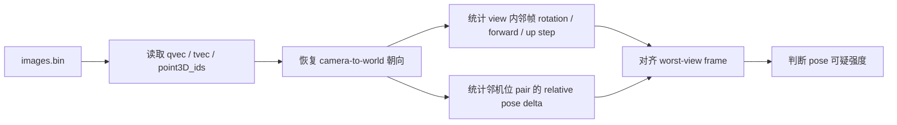
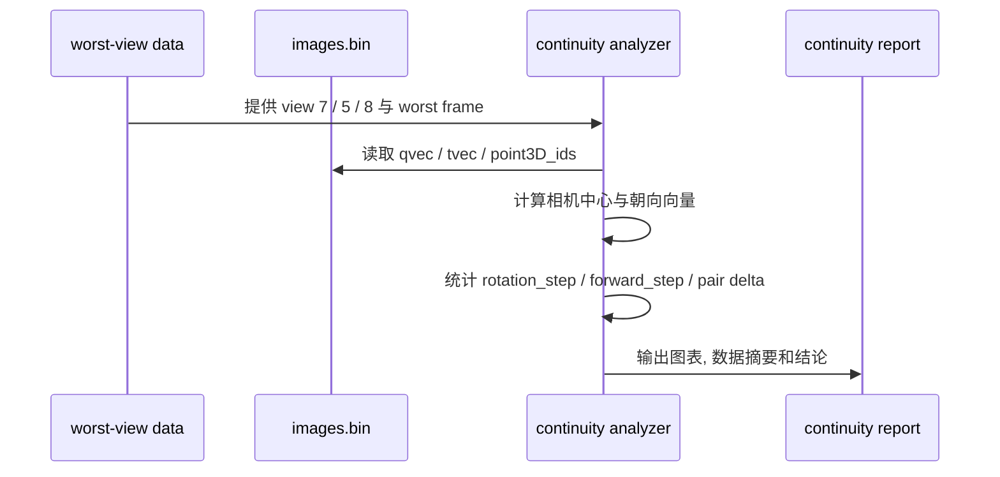

# `my5` 朝向连续性与相对位姿复核报告

## 背景

- 数据目录: `data/my5_colmap_fastgs`
- COLMAP 模型: `data/my5_colmap_fastgs/sparse/0/images.bin`
- 对应训练结果: `output/my5_nomask_v1`
- 重点机位:
  - `view 7`
  - `view 5`
  - `view 8`

上一轮报告已经确认了两件事:

1. `view 7` 的点支持最差.
2. `view 7` 的相机中心轨迹最抖.

但那还不够.

因为“相机中心在跳”不等于“相机朝向也在跳”.

这次我专门补看 2 条新证据:

1. 同一机位内部的朝向连续性.
2. 与邻机位之间的相对位姿连续性.

## 这次具体看什么

这份报告只回答一个问题:

> `view 7 / 5 / 8` 的异常, 到底有没有更直接的朝向连续性证据支撑?

我这次新增计算了:

- 邻帧相机相对旋转角
- 邻帧 forward 向量变化角
- 邻帧 up 向量变化角
- 邻机位 pair 的相对旋转变化量
- 邻机位 pair 的相对距离变化量

## 回查流程

## 已观察到的现象

### 1. `view 7` 的朝向步长也是全机位第一

按机位统计后的核心数字:

| view | mean rotation step | max rotation step | mean forward change | max forward change | mean observed pts |
| --- | ---: | ---: | ---: | ---: | ---: |
| `7` | `3.6893` | `6.0948` | `3.6831` | `6.0883` | `852.3` |
| `5` | `1.9935` | `2.8770` | `1.9915` | `2.8705` | `1238.9` |
| `8` | `0.6520` | `0.9852` | `0.6500` | `0.9850` | `1276.3` |

放回 12 个机位里一起看:

- `view 7`
  - `rotation_mean` 第 `1`
  - `rotation_max` 第 `1`
  - `forward_mean` 第 `1`
  - `forward_max` 第 `1`
- `view 5`
  - 基本都是第 `2`
- `view 8`
  - 只在中后段
  - 明显不像 pose 主导异常

一个更直观的对比是:

- `view 7` 的平均旋转步长约是 `view 8` 的 `5.66x`
- `view 7` 的平均旋转步长约是 `view 5` 的 `1.85x`

这已经不是边缘差异了.

### 2. `view 7` 的大抖动集中在前段 `frame 3 ~ 6`

`view 7` 旋转峰值前 5 帧:

| frame | rotation step | forward step | translation step | observed ratio |
| --- | ---: | ---: | ---: | ---: |
| `3` | `6.0948` | `6.0883` | `2.2542` | `0.2792` |
| `4` | `5.2982` | `5.2914` | `1.8567` | `0.2458` |
| `5` | `5.2160` | `5.1949` | `1.8295` | `0.2563` |
| `11` | `4.9833` | `4.9667` | `1.7934` | `0.5022` |
| `10` | `4.9445` | `4.9362` | `1.6937` | `0.3785` |

这组数字有一个很关键的特点:

- 最大朝向抖动, 刚好发生在点支持极低的前段
- 它不是“朝向稳, 只是平移抖”
- 它是“平移和朝向一起抖”

### 3. worst-view 和这条证据链是对得上的, 但不是完全重合

重点 worst test 帧回对:

| test 图 | view | frame | observed ratio | rotation step | forward step |
| --- | --- | ---: | ---: | ---: | ---: |
| `00031.png` | `7` | `6` | `0.2943` | `3.5802` | `3.5615` |
| `00033.png` | `7` | `22` | `0.4149` | `2.1979` | `2.1958` |
| `00024.png` | `5` | `4` | `0.5446` | `2.2997` | `2.2980` |
| `00026.png` | `5` | `20` | `0.6811` | `1.9098` | `1.9048` |
| `00037.png` | `8` | `27` | `0.5494` | `0.4322` | `0.4240` |

这里能读出两层信息:

- `00031.png`
  - 直接落在 `view 7` 的高抖区尾部
  - 同时点支持仍然非常低
- `00033.png`
  - 也有明显朝向变化
  - 但没有前段 `frame 3 ~ 5` 那么极端

这说明:

> `view 7` 的 worst-view 不是“全部由 pose 峰值单独解释”.

更稳的理解是:

- `view 7` 确实有 pose 连续性问题
- 同时它还叠加了材质 / 反射 / 匹配难度

### 4. 围绕 `view 7` 的邻机位相对位姿变化, 也是全局最不稳的两组

按相邻机位 pair 统计 `delta_relative_rotation_mean`:

| pair | mean delta relative rotation | max delta relative rotation | mean delta relative distance |
| --- | ---: | ---: | ---: |
| `7-8` | `2.1338` | `4.7595` | `0.7345` |
| `6-7` | `1.9313` | `4.3341` | `0.6830` |
| `4-5` | `1.3843` | `2.3677` | `0.3460` |
| `8-9` | `1.3272` | `1.8962` | `0.4710` |

这 2 组最不稳的 pair, 恰好都包住了 `view 7`.

这很重要.

因为如果只有 `view 7` 自己的朝向抖, 还能怀疑是单机位统计偶然.

但现在连:

- `6-7`
- `7-8`

两边的相对位姿变化都一起抬高了.

那就更像 `view 7` 把周边 pair 的连续性也带坏了.

## 图像证据

### 全局朝向散点

- [orientation_global_scatter.png](/root/autodl-tmp/home/rais/FastGS/specs/my5_pose_continuity_report_assets/orientation_global_scatter.png)

这张图里, `view 7` 在均值和峰值两个面板里都最靠右上.

### 重点机位逐帧诊断

- [focus_view_orientation_diagnostics.png](/root/autodl-tmp/home/rais/FastGS/specs/my5_pose_continuity_report_assets/focus_view_orientation_diagnostics.png)

这里能直接看到:

- `view 7` 的前段抖动明显高于 `view 5`
- `view 8` 基本是一条低幅平顺曲线

### 邻机位相对位姿诊断

- [neighbor_relative_pose_diagnostics.png](/root/autodl-tmp/home/rais/FastGS/specs/my5_pose_continuity_report_assets/neighbor_relative_pose_diagnostics.png)

这张图最适合看:

- `6-7`
- `7-8`

它们的相对旋转变化, 比 `4-5` 和 `8-9` 更容易出尖峰.

### forward 向量俯视图

- [focus_view_forward_quiver.png](/root/autodl-tmp/home/rais/FastGS/specs/my5_pose_continuity_report_assets/focus_view_forward_quiver.png)

这张图不是最终证据, 但很适合直观看:

- 机位在移动时, 相机到底往哪边看
- `view 7` 的箭头摆动是不是明显更碎

### 数据摘要

- [pose_continuity_data.json](/root/autodl-tmp/home/rais/FastGS/specs/my5_pose_continuity_report_assets/pose_continuity_data.json)

## 假设与验证

### 当前主假设

`view 7` 不只是“平移轨迹差”.

它还有更直接的朝向连续性异常.

而且这个异常已经强到会在邻机位 pair 上留下痕迹.

### 最强备选解释

还有一个必须保留的备选解释:

`view 7` 看到的高反射 / 弱纹理区域, 本身就更难做特征匹配.

于是会出现这种叠加:

1. 画面更难匹配
2. 点支持掉下去
3. 位姿也更容易不稳
4. 训练时这组视角继续最差

也就是说:

> 现在还不能把它写成“单一根因就是 pose 错了”.

更稳的说法是:

> `view 7` 存在真实的 pose 连续性异常证据, 但它很可能和材质 / 反射难点是叠加关系.

### 这次验证里我刻意没有过度放大的点

我有额外算 `baseline_dir_change`.

但这项指标在“pair 基线很短”时会放大数值波动.

所以这次我把它当辅助观察, 不把它当主结论依据.

主结论仍然主要建立在:

- 单机位 rotation / forward 连续性
- 邻机位相对旋转变化
- 以及和 low-observation / worst-view 的对齐关系

## 已验证结论

### 结论1

`view 7` 现在已经不只是“最强 pose 可疑点”.

它已经具备了更硬的一层证据:

- 朝向连续性全机位最差
- 邻机位相对位姿连续性也最差
- 且和 low-observation / worst-view 继续对齐

### 结论2

`view 5` 仍然是次级可疑点.

它确实比大多数机位更抖.

但无论看均值还是峰值, 都和 `view 7` 还差一档.

### 结论3

`view 8` 继续更像“画面难”, 不像“姿态主导问题”.

因为:

- 它的 rotation / forward 步长都很低
- `00037.png` 对应帧的朝向变化也很小

### 结论4

现在更稳的决策顺序仍然不是“继续堆训练步数”.

而是:

1. 先做 `view 7` 的局部 COLMAP 对照
2. 看 `frame 1 ~ 6` 这段前段是否能被修顺
3. 如果能改善, 再重新训练

## 下一步建议

### 方向A: 只围绕 `view 7` 做局部 COLMAP 对照

优先抽:

- `view 6`
- `view 7`
- `view 8`

以及 `frame 1 ~ 8` 附近的片段.

原因很简单:

- 最大 pose 峰值就在前段
- 这比整场景重跑更省时间
- 也更容易判断“是不是全局重建把这段解坏了”

### 方向B: 做一版保守筛帧对照

如果不想先碰 COLMAP matcher, 可以先试:

- 暂时去掉 `view 7` 里 `frame 3 ~ 6`
- 或至少把这段当对照组单独准备一版数据

如果这样训练后 worst-view 明显改善, 说明这段坏帧的破坏力是真实存在的.

### 方向C: 训练调优放到后面

当前证据下, 训练参数还不是最优先项.

因为几何 / pose 侧已经出现了更硬的异常信号.

先把前处理搞稳, 再谈继续往上堆迭代, 会更划算.
