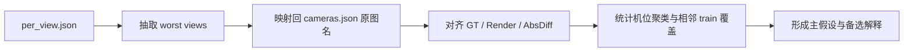
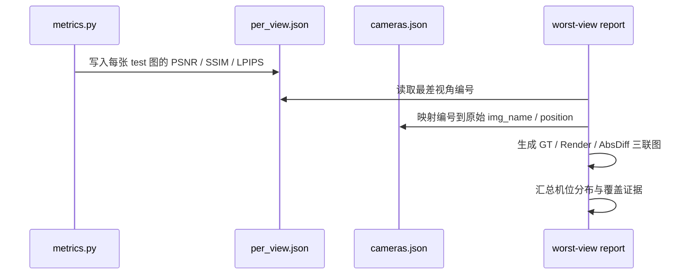

# `my5_nomask_v1` Worst-View 定位报告

## 背景

- 模型: `output/my5_nomask_v1`
- 评估轮次: `ours_35000`
- test 视角数: `41`
- 平均指标:
  - `PSNR = 27.2039413`
  - `SSIM = 0.8910136`
  - `LPIPS = 0.2026276`

## 这份报告回答什么

这份报告不再只看平均值.

它回答 3 个更具体的问题:

1. 现在最差的是哪些 test 视角.
2. 这些最差视角到底差在画面的什么位置.
3. 当前更像是“训练覆盖不够”, 还是“某些机位 / 某些高反射区域本身更难”.

## 诊断流程

## Worst 5 总表

| test 编号 | 原始图名 | 原始视角 | 帧号 | PSNR | SSIM | LPIPS |
| --- | --- | --- | --- | ---: | ---: | ---: |
| `00031.png` | `010_7_generated_videos_generated_video_0_000006` | `view 7` | `6` | `23.2433` | `0.8049` | `0.3074` |
| `00033.png` | `010_7_generated_videos_generated_video_0_000022` | `view 7` | `22` | `23.4800` | `0.8062` | `0.2846` |
| `00037.png` | `011_8_generated_videos_generated_video_0_000027` | `view 8` | `27` | `24.3451` | `0.8715` | `0.2350` |
| `00024.png` | `008_5_generated_videos_generated_video_0_000004` | `view 5` | `4` | `24.5445` | `0.8394` | `0.2435` |
| `00026.png` | `008_5_generated_videos_generated_video_0_000020` | `view 5` | `20` | `25.0808` | `0.8443` | `0.2414` |

## 现象

### 1. worst views 明显聚在少数机位

按 test 机位聚合后的平均 PSNR:

- `view 7`: `24.1812`
- `view 5`: `24.9605`
- `view 8`: `26.7086`

对比最好的一组:

- `view 2`: `28.8729`
- `view 1`: `28.5345`
- `view 3`: `28.2713`

这说明最差结果不是随机分布.

它更像是某几个物理机位整体更难.

### 2. 这些最差视角不是“没有邻近 train 帧”

对 worst 5 做同机位时间邻帧核查后:

- `00031.png` 的同机位最近 train 帧就是 `000005` / `000007`, 帧差 `1`
- `00033.png` 的同机位最近 train 帧就是 `000021` / `000023`, 帧差 `1`
- `00037.png` 的同机位最近 train 帧就是 `000026`, 帧差 `1`
- `00024.png` 的同机位最近 train 帧就是 `000003` / `000005`, 帧差 `1`
- `00026.png` 的同机位最近 train 帧就是 `000019` / `000021`, 帧差 `1`

这条证据很重要.

它至少说明一件事:

当前最差视角不能简单归因成“test 刚好离 train 太远”.

### 3. 误差主要集中在右侧高反射区域, 以及天花灯带和地面反射

肉眼对比 GT / Render / AbsDiff 后, 几张 worst views 的共性比较明显:

- 右侧屏幕墙一带的细节更容易被抹平
- 斜着穿过画面的灯带, 位置和亮度更容易漂
- 地面镜面反射区域误差很重
- 中央展台小车本体不是最主要的问题

也就是说, 当前误差更像集中在:

- 高反射
- 细长高亮边缘
- 斜视角下的透视与反射叠加区域

而不是整个场景都一起崩掉.

## 图像证据

### worst 5 总览

- 总览图: [worst5_contact_sheet.png](/root/autodl-tmp/home/rais/FastGS/specs/my5_worst_view_report_assets/worst5_contact_sheet.png)

### 单张三联图

- [00031_panel.png](/root/autodl-tmp/home/rais/FastGS/specs/my5_worst_view_report_assets/00031_panel.png)
- [00033_panel.png](/root/autodl-tmp/home/rais/FastGS/specs/my5_worst_view_report_assets/00033_panel.png)
- [00037_panel.png](/root/autodl-tmp/home/rais/FastGS/specs/my5_worst_view_report_assets/00037_panel.png)
- [00024_panel.png](/root/autodl-tmp/home/rais/FastGS/specs/my5_worst_view_report_assets/00024_panel.png)
- [00026_panel.png](/root/autodl-tmp/home/rais/FastGS/specs/my5_worst_view_report_assets/00026_panel.png)

### 对照视角

- 最好的一张 test 视角之一:
  - `00000.png`
  - 原始图名: `001_0_generated_videos_generated_video_0_000001`
- 对照三联图:
  - [00000_panel.png](/root/autodl-tmp/home/rais/FastGS/specs/my5_worst_view_report_assets/00000_panel.png)

对照图很能说明问题.

`00000` 的误差主要是轻微亮度和边缘差异.

而 worst views 的误差是一整块高反射区域都在抖.

## 假设与证据

### 当前主假设

最差视角更像是“斜视角下的反射 / 发光 / 细长边缘”组合难点.

换句话说, 当前模型在这些机位上更容易把真实的镜面与高频结构抹平.

#### 支撑这条假设的证据

- 视觉证据:
  - worst 图里的亮灯边缘、右侧玻璃 / 屏幕墙、地面反射误差最重
- 分布证据:
  - 问题集中在 `view 7` 和 `view 5`, 不是随机散在 41 张 test 图里
- 覆盖证据:
  - 同机位相邻 train 帧就在前后 `1` 帧, 不像“缺训练覆盖”

### 最强备选解释

某些机位可能还带着轻微位姿偏差.

尤其是 `view 7` 整组都偏差明显, 这有可能不是纯材质问题, 而是:

- COLMAP 在这组相机上的姿态稍微歪了
- 这种偏差在镜面和细长光带上被放大了

#### 为什么它还是备选解释

目前我有两类证据:

- 静态证据:
  - 问题高度集中在少数机位
  - 这些机位整体比别的机位差
- 动态证据:
  - 三联图里误差确实沿着结构边缘和反射面分布

但我还缺一类直接证据:

- 这几个机位在 COLMAP 轨迹里是否真的有异常姿态
- 或者同机位 train 视角本身是否也能复现同一种错位

所以现在还不能把“位姿偏差”写成已确认根因.

## 已验证结论

### 已确认的事实

- worst views 主要集中在 `view 7 / 5 / 8`
- 问题不是简单的“test 视角离 train 太远”
- 误差主要打在:
  - 右侧高反射墙面 / 屏幕区域
  - 天花灯带
  - 地面反射
- 当前 `35000` 相比 `30000` 虽然平均分更好, 但这些 worst views 仍然是瓶颈

### 还不能下死结论的部分

- 还不能确认“根因就是 COLMAP 位姿错误”
- 也还不能确认“根因完全是反射材质太难”

目前更稳的说法是:

> 当前证据更支持“少数机位上的反射 / 细高亮边缘是主要难点”, 同时不排除这些机位还叠加了轻微位姿偏差.

## 下一步建议

### 方向A: 先查几何, 这是更稳的顺序

优先针对 `view 7 / 5 / 8` 做相机位姿回查:

- 把这几个机位在 COLMAP 里的相机中心和朝向单独画出来
- 对比它们和相邻机位是否有异常跳变
- 如果有异常, 先处理位姿, 再继续调训练

### 方向B: 直接查画面, 成本低, 见效快

补一轮更细的对照:

- 把 worst-view 的同机位前后 train 邻帧也渲染出来
- 看 train 邻帧是不是也有同一种结构抹平

如果 train 邻帧也同样差, 更像材质 / 表达能力问题.

如果 train 邻帧明显更好, 反而是 test 插值 / 位姿更可疑.

### 方向C: 再谈训练调优

如果几何没明显问题, 再考虑继续做训练侧实验, 比如:

- 保留这组 `35000` 参数不动, 只改更适合高反射场景的策略
- 或者用更强的几何先验 / 已知位姿路线做对照

当前不建议直接盲目继续堆更高迭代数.

因为 worst views 的模式已经比较集中了.

先查清“机位偏差”还是“高反射难点”, 性价比更高.
